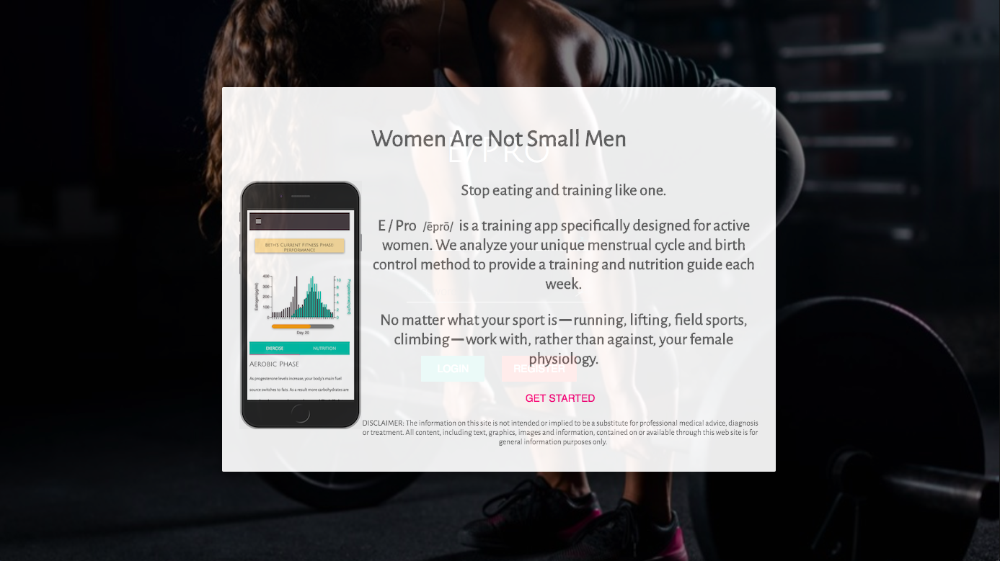
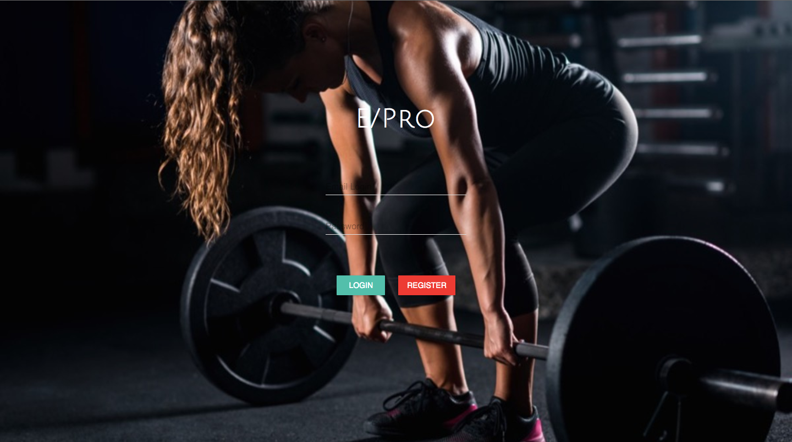
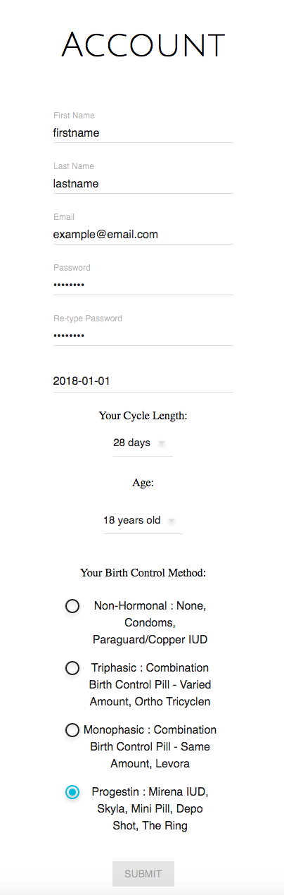
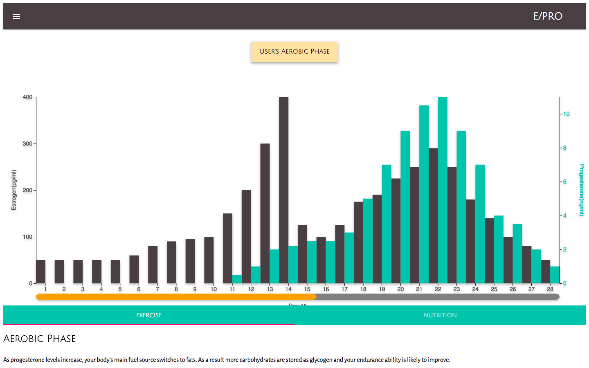
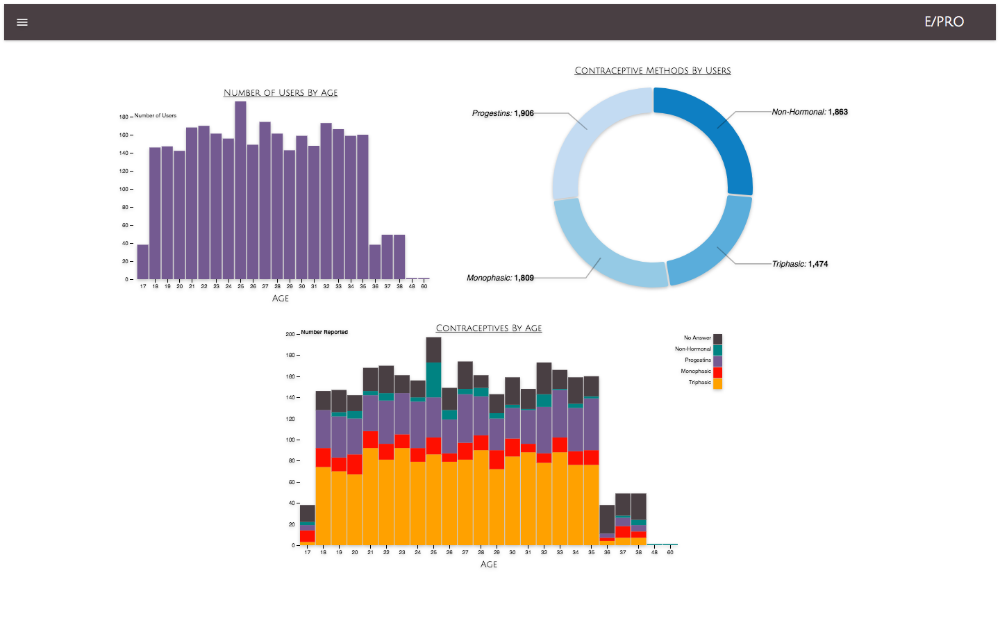
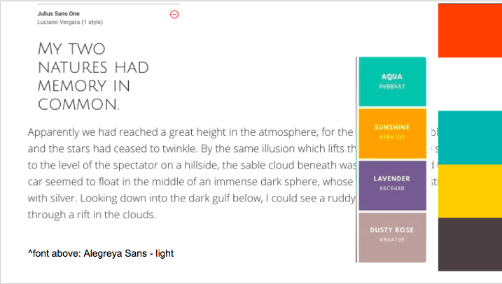
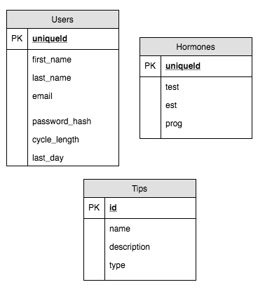

# E/PRO

### This fitness application is primarily designed for the scheduling of workout and nutritional regimen in harmony to user-specific hormonal cycle.


Motivation

The motivation behind this project came from a need within the fitness community to optimize workout and nutritional routines in accordance to estrogen and progesterone levels.  By automizing hormonal, exercise, and dietary tracking, this app not only helps women achieve peak physical performance but also saves time to pursue other professional or recreational endeavors.  Additionally, the app is both mobile and desktop friendly so that users may access their schedule while stationary or in-transit.  Finally, metadata representing the user base may aid pharmaceutical, marketing, and distributive operations for female centered fitness organizations.

### Getting Started

Prerequisites: NodeJS

First, navigate to the preferred local directory that to host the demo site.

Next, access the demo site by cloning the Github repository:

```bash
$ git clone https://github.com/Professional0321/react_python3_d3
```

Navigate inside the directory 'Q3_Project_Galvanize' and run the following commands:
```bash
$ yarn install
$ yarn start
```

A local browser should automatically open the site:

http://localhost:3000/



The lead-in page provides potential users 'call-to-action' in registering for the app through fitness and time-saving incentives.  The lead-in page summarizes the app functionality and brings users to a log-in and registration module.

### Site Navigation for a Sample User
On the lead-in page, click on 'GET STARTED' to access the log-in and registration module.

Log in with the following credentials:
* username : user@test.com
* password : password

Click "Login"

### Site Navigation for a New User

On the lead-in page, click on 'GET STARTED' to access the log-in and registration module.



New clients will be brought to a registration page that collects their name, email, password, first day of last period, cycle length, age, and birth control method.



Upon clicking submit, new users will be brought to a personal page that details a suggested workout and nutritional regimen based on estrogen and progesterone levels.  To access exercise suggestions, click on 'EXERCISE.'  To access nutritional advice, click on 'NUTRITION.'



The estrogen and progesterone levels are calculated from medical surveys on the contraceptive's specific effects on hormonal levels.  Registered users will always have access to the workout/nutritional regimen page contingent upon logging in with the correct email and password.

The top navigation bar houses both the E/Pro title and a triple bar that triggers a left-side drawer.  This left-side drawer leads both to the user's personal page and a userbase page.  The userbase page provides metadata on the entire userbase which details the number of users by age, contraceptive methods by number of users, and contraceptive methods by age and number of users.



### App Development

E/PRO is the culmination of an intensive one-week production to demonstrate skillsets gained during the third quarter of the Galvanize Web Immersive program.  The ultimate goal is to deploy a production-ready mobile-friendly app that aids women in scheduling fitness and diet in accordance to hormonal cycles.

Real-Time Task Management:  
https://trello.com/b/2UcMtrMG/e-pro

Color Schema and Styling:  


Entity Relationship Diagram:  


Server Routes and Seed Data:  
https://github.com/nigelflippo/epro_api

### Contributions

Galvanize Instructors:  
Teddi Maull (Product Manager)  
Jodie Rigali  
Sean Helvey

App Authors:  

Melissa Utomo:
* Team Lead  
* Operations Manager  
* Color Code and Styling Schema
* Test Data Seeding  
* MaterialUI Development (React Framework)
* MaterialUI Interface with Python Web Servers  
* MaterialUI Interface with D3 Visualization  
* Code Debugging and Troubleshooting

Stephanie Marvez:  
* Pharmaceutical Research  
* Fitness Protocol Research  
* Test Data Seeding  
* D3 Visualization Client-Side Development
* D3 Visualization Interface with Python Web Servers
* D3 Visualization Interface with MaterialUI Frontend
* Code Debugging and Troubleshooting

Nigel Flippo:  
* Entity Relationship Diagram  
* Test Data Seeding  
* Python Web Server Development (Flask Framework)
* Python Web Server Interface with MaterialUI
* Python Web Server Interface with D3 Visualization
* Code Debugging and Troubleshooting

Tracey Dolsen:
* Color Code and Styling Schema
* Adobe Photoshop Image Enhancement
* Test Data Seeding
* D3 Visualization User-Base Development
* D3 Visualization Interface with Python Web Servers
* D3 Visualization Interface with Material UI Frontend
* Code Debugging and Troubleshooting

Neal Balaoing:  
* Initial Wireframing  
* Test Data Seeding  
* MaterialUI Development (React Framework)  
* Python Web Server Routes Testing  
* Readme Compilation  
* Code Debugging and Troubleshooting  

Built With
* React.js
* MaterialUI
* D3 Visualization
* Moment.js
* Python
* Flask
* PostgreSQL
* Node.js
* HTML
* CSS
* JavaScript
* NPM
* Trello - Planning Purposes

### Versioning
We use SemVer for versioning. For the versions available, see the tags on this repository.


### License
This project is licensed under the MIT License
